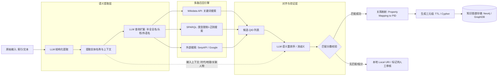
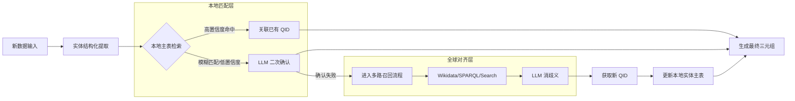

# PnPDataset Project Documentation

## 项目概述 (Project Overview)

本项目旨在对17-18世纪欧洲艺术史索引数据进行全面的清洗、标准化与重构。通过从原始PDF/Markdown提取数据，经过多轮清洗、实体对齐（Wikidata）及LLM增强，最终生成高质量的结构化数据集。

## 详细文档 (Detailed Documentation)

更深入的技术实现细节、模型参数说明及处理逻辑，请参阅：

- **[PROJECT_DETAILS.md](./PROJECT_DETAILS.md)**: 项目详细技术说明与操作指南。
- **[06-LLM-Enhancement/Reademe-A.md](./06-LLM-Enhancement/Reademe-A.md)**: LLM 增强阶段的技术报告。

## 目录结构说明 (Directory Structure)

### 1. 原始资源与基础数据 (Raw Resources)

* **00-book/**: 原始书籍《Patrons and Painters》的PDF章节。
* **02-Markdown/**: 书籍章节的Markdown转换版，用于文本分析。
* **03-Index/**: 索引数据处理核心文件夹。
  * `03-1-Index-MD/`: 索引部分的Markdown文件。
  * `03-2-Index-CSV/`: 从Markdown解析出的原始CSV。
  * `03-3-Index-PDF/`: 索引部分的PDF拆分。
  * `03-4-Index-Enrich/`: 初步清洗与增强后的CSV。

### 2. 参考与中间处理 (Reference & Intermediate)

* **04-HandmadeDataset/**: 人工校验参考库（地名、人名、作品）。
* **05-EntityMerge/**: 实体初步合并与去重的中间结果。
* **06-LLM-Enhancement/**: **[关键步骤]** 使用 Gemini 1.5 Pro 进行的语义增强结果。
  * 包含分批次的CSV结果及详细的技术执行报告 (`Reademe-A.md`, `Reademe-B.md`)。

### 3. 结果与验证 (Results & Validation)

* **07-Data-Remerge/**: 重新合并与审计后的数据集。
* **08-QID-Crosscheck/**: **[当前最新数据]** 包含 Wikidata QID 的最终清洗版数据。
  * `02-Merged_Recheck_With_QID_Cleaned.csv`: 最终交付的核心文件。
* **BU-Crosscheck/**: 与 Getty/Wikidata 交叉验证的审计日志。
* **BU-UNMatched/**: 未匹配数据的清理指南与备份。

  11-ORG、12-Final-Dataset、14-Relation合并后即为完整数据集
  13-PNPQID为12-Final-Dataset补充Wikidata信息 和转换数据格式
  14-Relation包括：
      index:01 -> 05 -> 06 ->07 
      worklist:02 
      handmade:03 

### 4. 代码工具 (Codebase)

* **Process-Python/**: 全套 Python 处理脚本。
  * `01-Process/`: 当前使用的标准化处理流程脚本。
  * `Archive/`: 历史版本与实验性脚本。

## 数据说明 (Data Description)

本项目产出的核心数据位于 `08-QID-Crosscheck/`，主要字段包括：

- `Refined_Formal_Name`: 标准化后的实体名称（英文）。
- `QID`: 对应的 Wikidata 唯一标识符。
- `Refined_Category`: 实体分类（Person, Work, Place, Organization, etc.）。
- `Status/Notes`: 数据状态、来源说明或校验备注。

## 操作步骤 (Operational Steps)

详细的操作流程请参考 `Process-Python/01-Process/` 中的脚本顺序：

1. **环境准备**: 确保安装 `pandas`, `openpyxl` 等必要 Python 库。
2. **初步分类**: 运行 `01_Apply_Initial_CIDOC.py` 进行基础分类。
3. **数据清洗**: 顺序运行 `02` 至 `06` 脚本修复错误、重命名列。
4. **地理增强**: 运行 `07` 至 `10` 脚本进行地理位置的中文备注与语义增强。
5. **组织与审计**: 运行 `11_Organize_Workspace.py` 整理目录，`12_Generate_Crosscheck_Files.py` 生成校验报告。

## 流程梳理

整体处理流程

Index数据处理流程（ 新增数据）

---

*Generated by GitHub Copilot*
